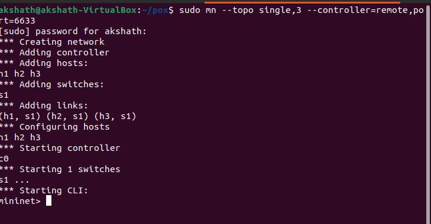
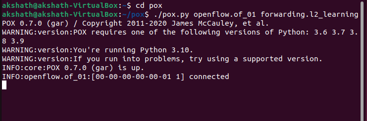
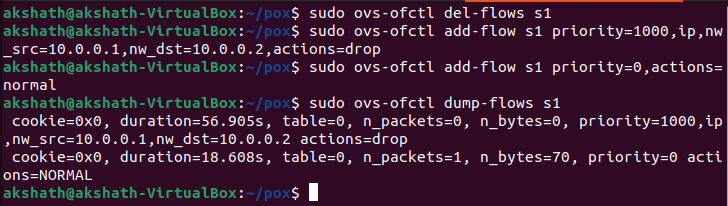
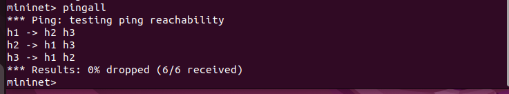
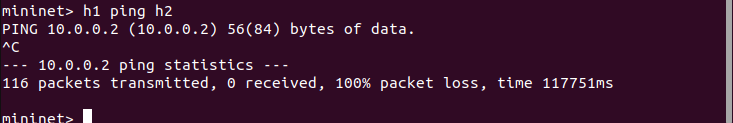
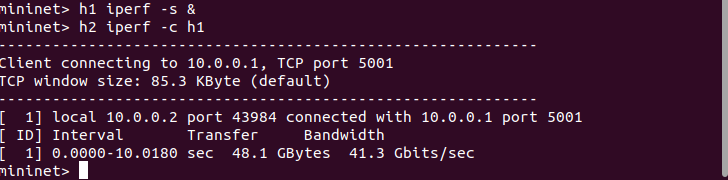
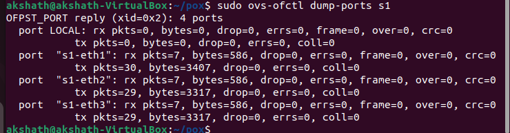
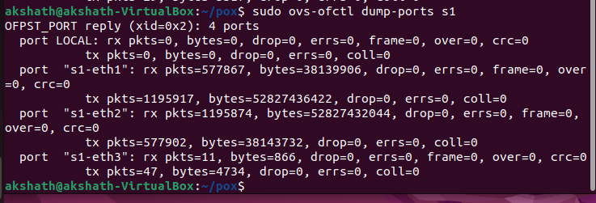
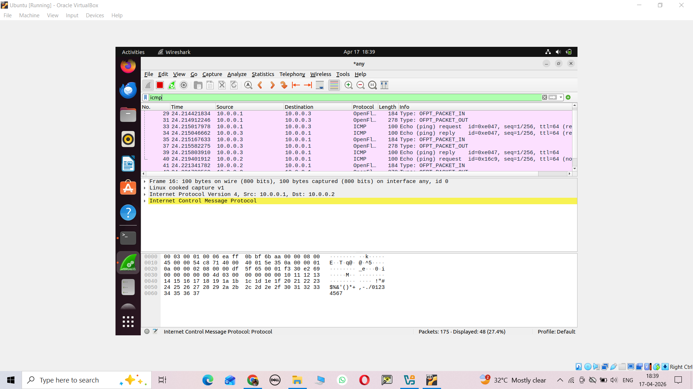
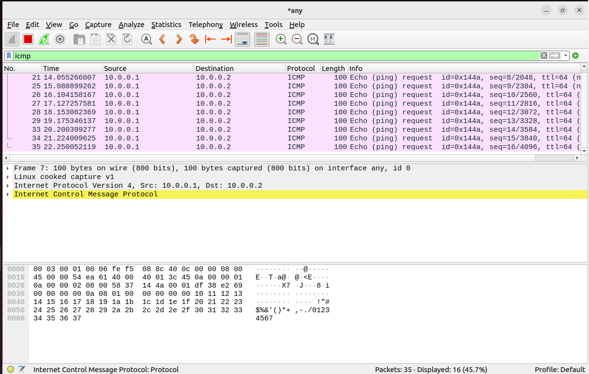

# 🚀 SDN Network Utilization Monitor using Mininet

## 📌 Project Overview
This project demonstrates a Software Defined Networking (SDN) based network using Mininet. It monitors network traffic, applies flow rules, blocks specific traffic (ICMP), and analyzes bandwidth utilization using tools like iperf and Wireshark.

---

## 🎯 Objectives
- Create a custom network topology using Mininet
- Implement SDN controller-based flow rules
- Monitor network utilization
- Block ICMP (ping) traffic
- Analyze traffic using Wireshark
- Measure bandwidth using iperf

---

## 🛠️ Tools & Technologies Used
- Mininet
- Ryu Controller
- OpenFlow Protocol
- Wireshark
- iperf
- Python

---

## 🌐 Network Topology
This shows the structure of hosts and switches in the network.



---

## 🎮 Controller Execution
Ryu controller managing the network and installing flow rules.



---

## 🔄 Flow Table Rules
Flow entries installed in switches by the controller.



---

## 📡 Ping Test (Connectivity Check)
All hosts successfully communicate with each other.



---

## 🚫 Blocking ICMP Traffic
Ping between hosts is blocked using flow rules.



---

## 📊 Bandwidth Measurement using iperf
TCP traffic test to measure throughput between hosts.



---

## 📈 Network Utilization Monitoring

### Before Traffic
Network usage before generating traffic.



### During Traffic
Network usage during heavy traffic.



---

## 🔍 Packet Analysis using Wireshark

### ICMP Traffic Capture
Normal ICMP packets observed.



### Blocked Traffic Capture
No ICMP packets observed after blocking.



---

## ⚙️ Features Implemented
- Custom SDN topology
- Dynamic flow rule installation
- ICMP traffic blocking
- Real-time network monitoring
- Bandwidth analysis
- Packet-level inspection

---

## 📌 Conclusion
This project successfully demonstrates how SDN can control and monitor network behavior dynamically. It shows how traffic can be managed, analyzed, and restricted efficiently using a centralized controller.

---

## 📂 Project Structure
project/
│── README.md
│── screenshots/
│     ├── topology.png
│     ├── controller.png
│     ├── flows.png
│     ├── pingall.png
│     ├── blocked_ping.png
│     ├── iperf_tcp.png
│     ├── utilization_before.png
│     ├── utilization_during.png
│     ├── wireshark_icmp.png
│     ├── wireshark_block.png
```
